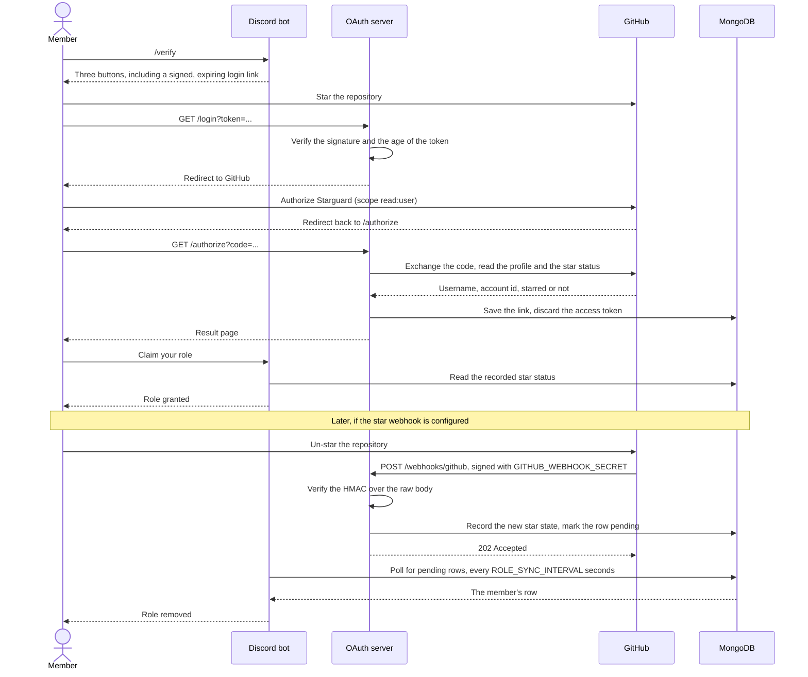

# Starguard
<p align="center">  </p>

Starguard is a Discord bot that grants a role to members who star a GitHub
repository, and takes the role back when they un-star it. Members prove the
star through GitHub OAuth, so nobody has to be trusted or checked by hand.

## Features

- ✔️ User Validation: members verify with GitHub OAuth, over a personal link
  that expires.
- 💫 Role Assignment: the role is granted **only** if the member has starred
  the configured repository.
- 🔍 Periodic Checks: the bot re-checks every verified member and removes the
  role from anyone who un-starred. With the optional GitHub webhook
  configured, a star or an un-star moves the role within seconds instead, and
  the periodic check becomes the backstop rather than the main mechanism.

## Usage

The bot works through slash commands:

- `/verify`: start verification. Sends three buttons: star the repo, sign in
  with GitHub, claim the role.
- `/checkstars`: run the un-star check now and report what changed.
- `/starcount`: the total number of stargazers for the repository.
- `/ping`: the bot's gateway latency.
- `/help`: the list of commands.
- `/your-custom-name`: an optional command that shows up to four buttons
  linking to addresses of your choice. Configured with `COMMAND_NAME` and the
  `BTN1`/`URL1` pairs, and not registered at all if you leave them empty.

Here's an example of the `/verify` command:


## Architecture

Starguard runs as **two processes** that share one database and one
`SECRET_KEY`:

- **The Discord bot** (`python -m bot.bot`) owns everything inside Discord: the
  slash commands, granting and removing the role, and the periodic star check.
  It mints each member a personal login link, signed with `SECRET_KEY` and
  valid for 15 minutes.
- **The OAuth callback server** (`python -m server.server`) is a small Flask
  application served by waitress. It owns the GitHub side: it verifies the
  signed link, runs the OAuth flow, and records the result. It needs a public
  HTTPS address because members reach it from a Discord button.
- **MongoDB** holds one document per verified member, linking a Discord ID to
  a GitHub account and the current star state. **The GitHub access token is
  used during the request and then discarded**, never stored.

The two processes never talk to each other directly. The signed link token is
what carries a Discord identity from one to the other, and the database is
what carries the result back.

That shape decides how the optional star webhook works, so it is worth
stating plainly. GitHub delivers a `star` event to the **OAuth server**,
because that is the half with a public address. Only the **bot** can change a
Discord role, because that is the half connected to the Discord gateway. So
the server does not move the role and cannot ask the bot to: it records the
new star state and marks the row pending, and the bot drains that queue every
`ROLE_SYNC_INTERVAL` seconds, 30 by default. The database is the entire
channel between them, exactly as it already is for verification.



Every `AUTOMATIC_CHECK_DELAY` seconds the bot lists the repository's
stargazers, compares them against the database, and removes the role from
anyone who is no longer there. The listing is fetched with conditional
requests, so pages that have not changed cost nothing against the GitHub rate
limit.

**The webhook is optional and Starguard works without it.** Set no
`GITHUB_WEBHOOK_SECRET` and the receiver is never registered. The periodic
check is then the only automatic mechanism, and it works in one direction
only: it **removes** the role from anyone who has left the stargazer listing,
and it never grants one, so a member who stars after verifying has to sign in
with GitHub again before the role can be claimed. It also costs one GitHub API
request per 100 stargazers on every pass. Set the secret and both directions
arrive on their own, in seconds and for free.

The periodic check stays on either way. [GitHub does not automatically retry
a failed
delivery](https://docs.github.com/en/webhooks/using-webhooks/handling-failed-webhook-deliveries),
so an event sent while the server was restarting is gone unless somebody
redelivers it by hand, and the periodic check is the only thing that repairs
that on its own. What the webhook buys is the freedom to run the check daily
rather than hourly. See
[Step 12 of the installation guide](./docs/installation.md#step-12-set-up-the-star-webhook-optional).

Both processes expose a health endpoint, and the compose files probe them.

## Installation

- **[detailed installation guide](./docs/installation.md)**
- **[detailed env configuration guide](./docs/env_file.md)**
- **[troubleshooting](./docs/troubleshooting.md)**

1. 🧑‍🤝‍🧑 Clone the repository.
2. ✏️ Copy `.env.example` to `.env` and configure it, including a real
   `SECRET_KEY`:
   ```sh
   python -c "import secrets; print(secrets.token_urlsafe(32))"
   ```
3. 🗄️ Pick a database. For the bundled MongoDB, copy `override.example.yml` to
   `docker-compose.override.yml` and set **four** variables plus a matching
   `MONGO_HOST`: `MONGO_INITDB_ROOT_USERNAME`, `MONGO_INITDB_ROOT_PASSWORD`,
   `MONGO_EXPRESS_USERNAME` and `MONGO_EXPRESS_PASSWORD`. That override file
   brings up the Mongo Express admin UI as well as the database, and it
   requires all four: leave any of them unset and Compose stops before it
   starts anything, with `required variable MONGO_EXPRESS_USERNAME is missing
   a value` or the equivalent for whichever is missing. The two Mongo Express
   lines are commented out in `.env.example`, so uncomment them and fill them
   in.
4. 🐳 Run `docker compose up -d --build`.

> **Upgrading from an older version?** See
> [Upgrading](./docs/installation.md#upgrading-from-an-older-version). The
> bundled MongoDB now requires authentication, which needs a manual step on an
> existing database, and earlier releases stored GitHub OAuth tokens that you
> should revoke.

## Requirements

- Docker and Docker Compose
- A MongoDB (one is bundled, see [override.example.yml](./override.example.yml))
- A Discord bot token, with the Server Members Intent enabled
- A GitHub OAuth app client ID and secret
- A public HTTPS domain pointing at the OAuth server
- Optionally, a GitHub personal access token to raise the API rate limit
- Optionally, admin access to the repository, to add the star webhook

## Privacy

Starguard asks GitHub for the `read:user` scope only: enough to read your
public profile and check whether you starred the repository. It records your
GitHub username and numeric ID against your Discord ID. **The OAuth access
token is used during the request and then discarded**, and is never written to
the database or to the logs.

## Development

```sh
pip install --require-hashes -r requirements-dev.lock
pytest -q --cov
```

Run the two processes directly with `python -m bot.bot` and
`python -m server.server`; both read the same `.env`.

CI gates every pull request, and every push to `main`, on ruff, mypy, pylint,
bandit, an audit of both lockfiles, a check that neither lockfile has drifted
from its `.txt` source, the test suite on Python 3.11 and 3.12 under a
100 percent coverage gate, and hadolint plus a build of both Docker images.
See [CONTRIBUTING.md](./CONTRIBUTING.md) for the commands to run the same
checks locally, and [CHANGELOG.md](./CHANGELOG.md) for what has changed.

## Python Libraries and Resources

- This project uses the following libraries and resources:
    - [Flask](https://pypi.org/project/Flask/) A lightweight web framework for Python that provides tools and features to create web applications.
    - [python-dotenv](https://pypi.org/project/python-dotenv/) A module that reads key-value pairs from a .env file and sets them as environment variables.
    - [authlib](https://pypi.org/project/Authlib/) A library that implements various authentication protocols and specifications, such as OAuth, OpenID Connect, and JWT.
    - [pymongo](https://pypi.org/project/pymongo/) A Python driver for MongoDB that allows you to work with MongoDB databases and collections in Python.
    - [Interactions.py](https://pypi.org/project/interactions.py/) A library that simplifies the creation and handling of Discord slash commands and components in Python.
    - [requests](https://pypi.org/project/requests/) A popular HTTP library for Python that allows you to send and receive HTTP requests in a simple way.
    - [waitress](https://pypi.org/project/waitress/) A production WSGI server used to serve the OAuth callback app.
    - [itsdangerous](https://pypi.org/project/itsdangerous/) Signs the verification links so a Discord identity cannot be forged.

## License

[MIT](https://github.com/fuegovic/Starguard/blob/main/LICENSE)
